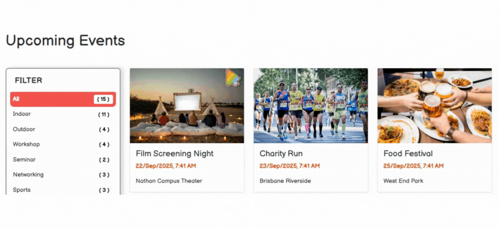

# Events Booking System
[](#)
[](#)
[](#)
[](#)
[](#)
[](#)

A Laravel-based web for managing events, organisers, attendees, and bookings.  
This project is developed as part of **Programming 2 Final Project** at Griffith University.

---

## 🎥 Live Demo


---

## ✨ Features

### 🗓 Event Management
- List all events with organiser and attendee details
- View event detail pages
- Seeder-generated fake data for testing

### 🎟 Booking
- Book or cancel events
- Prevent duplicate booking with validation
- Track user-specific bookings

### 🔎 Filtering & Pagination
- AJAX-based category filtering
- Dynamic pagination without full page reload

---
## ⚙️ Setup - ELF or Local Environment

### (a) ELF Environment
1. Upload and extract the project files into the `~/html/` directory.  
2. Run the following commands in the project folder:  
   ```bash
   composer install
   cp .env.example .env
   php artisan key:generate
   php artisan migrate:fresh --seed
   php artisan serve
3. Access the system at:
   ```bash
   https://s0123456.elf.ict.griffith.edu.au/final_project/public/
  Replace **studentID** with your own Griffith student number (e.g., `s0123456`)

4. If issues occur, download and run locally (see below).

### (b) Local Environment
1. Clone the repository
   ```bash
   git clone https://github.com/josh-yo/events_booking.git
   cd events_booking
2. Install dependencies
   ```bash
   composer install
3. Run the following commands:  
   ```bash
   cp .env.example .env
   php artisan key:generate
   php artisan migrate:fresh --seed
   php artisan serve
4. Visit: http://yourlocalhost:8000

---

## 👥 Test Accounts

You can use the following test accounts (seeded by the system):

### Organiser
- **Email**: organiser01@test.com  
- **Password**: password  

### Attendee
- **Email**: attendee01@test.com  
- **Password**: password  

### 🆕 Register
Alternatively, you can register a new account through the **Sign Up** page.  
New users are registered as **Attendees** by default.

---
